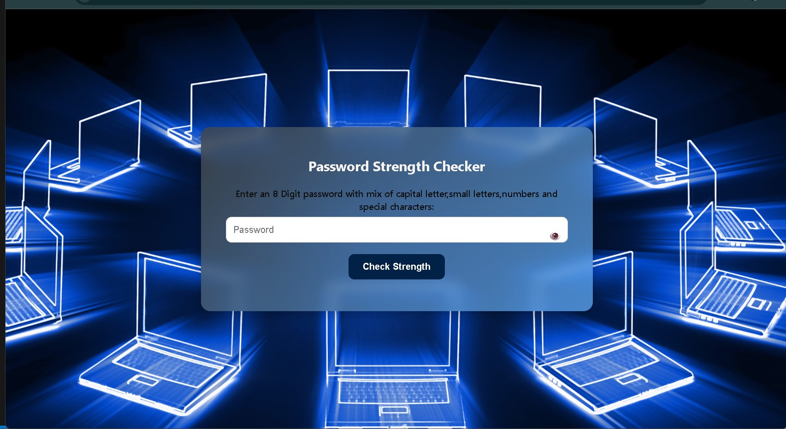
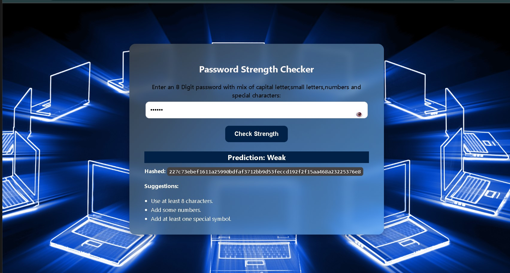
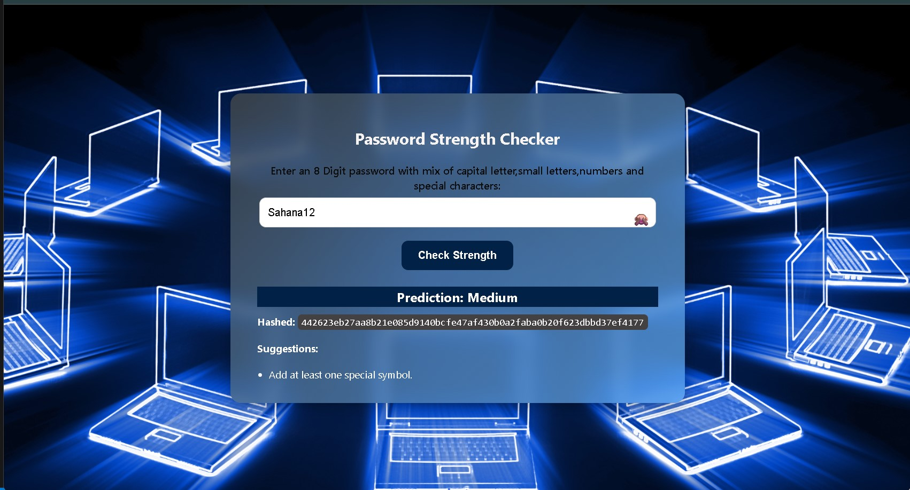

# AI-Powered Password Strength Checker

## Project Overview

This project is a lightweight, AI-powered web application that assesses the strength of user-entered passwords in real time. It uses a Random Forest machine learning model trained on a synthetic dataset to classify passwords into categories: **Weak**, **Medium**, **Strong**, and **Very Strong**.

The application combines a Python CGI backend for prediction logic with a responsive HTML/CSS/JavaScript frontend, delivering instant feedback and improvement suggestions without relying on heavy web frameworks.

---

## Features

- Secure password strength classification using machine learning
- Real-time interactive feedback as the user types
- SHA-256 hashing of passwords for secure display purposes
- Suggestions to help users improve weak or medium-strength passwords
- Pure Python and vanilla JS implementation with CGI for easy deployment
- Synthetic dataset generation and model training scripts included

---

## Technologies Used

- Python 3.8+
- Scikit-learn (Random Forest Classifier)
- Pickle (for model serialization)
- Python built-in CGI module
- HTML, CSS, JavaScript (vanilla) for frontend
- Python’s built-in HTTP server (`http.server`) with CGI support

---

## Setup Instructions

1. **Clone the repository:**

git clone https://github.com/SahanaG2003/AI-Driven-Password-Strength-Checker-with-Real-Time-Web-Interface/edit.git
cd your-repository

text

2. **Create and activate a virtual environment:**

python -m venv venv

Windows
venv\Scripts\activate

macOS/Linux
source venv/bin/activate

text

3. **Install dependencies:**

pip install -r requirements.txt

text

4. **Start the CGI-enabled HTTP server:**

python -m http.server --cgi 8000

text

5. **Open your browser and navigate to:**

http://localhost:8000/index.html

text

---

## Usage

- Enter your desired password in the input field.
- View the real-time strength rating, password hash, and tailored improvement suggestions.
- Use this tool to improve your password security effectively.

---

## Project Structure

| File/Folder              | Description                               |
|-------------------------|-------------------------------------------|
| `dataset.py`            | Script to generate synthetic password data |
| `train_model.py`        | Script to train the machine learning model |
| `features.py`           | Functions to extract password features     |
| `cgi-bin/check_password.py` | CGI script handling password predictions |
| `index.html`            | Frontend HTML page with form and JS       |
| `password_strength_model.pkl` | Trained machine learning model file      |
| `password_dataset.csv`  | Synthetic dataset CSV                      |
| `venv/`                 | Python virtual environment (excluded in Git) |

---

## Screenshots

### Password Input and Feedback

### Strength Prediction with Suggestions

## Future Enhancements

- Integration of breached password APIs for additional security checking.
- Expansion of dataset with real user passwords (with privacy considerations).
- Implementation of more sophisticated ML/DL models like XGBoost or neural networks.
- Dockerization and cloud deployment for scalability.
- Multi-language support and accessibility improvements.

---

## License

This project is for **educational purposes** only. Feel free to use and modify it as needed.

---

## Contact

For any questions or suggestions, reach out via GitHub Issues or contact [your-email@example.com].

---

*Thank you for exploring this AI-Powered Password Strength Checker project!*
